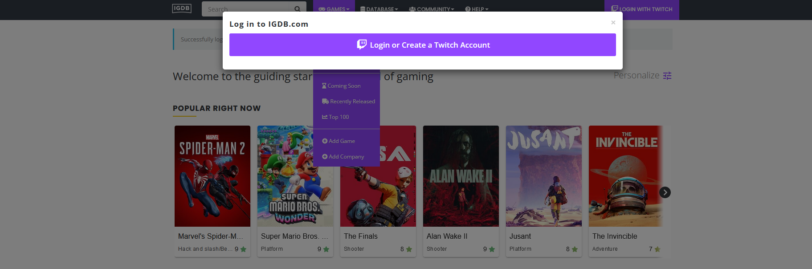
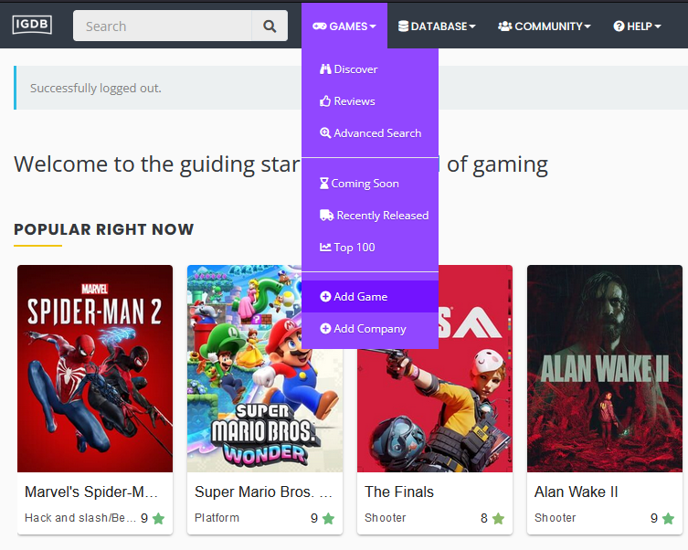
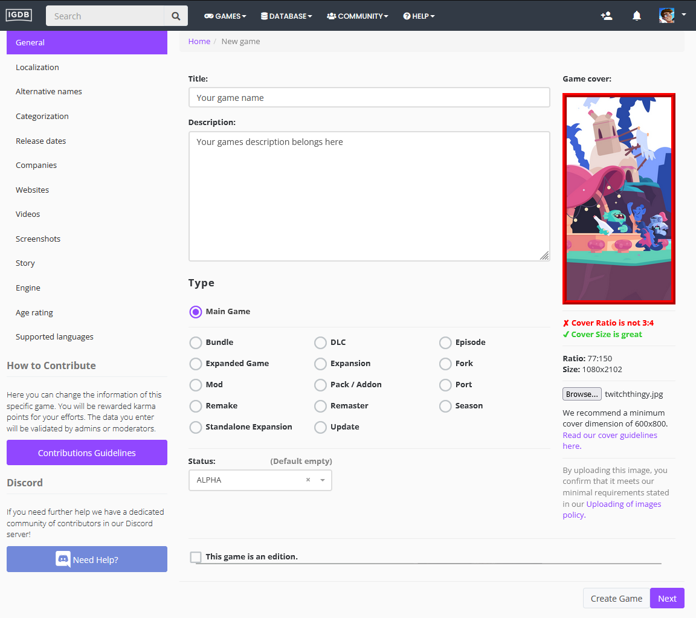

# How to add your game to Twitch

## Why is this important?

Having your game on Twitch allows people to select your game when they are streaming. This will allow them to show that they are playing your game and will allow people to find your game when they are browsing Twitch.

## How to add your game to Twitch

1. Go to [IGDB.com](https://www.igdb.com/discover) and click **Log In**. Log in with your Twitch account.

2. Once logged in head over to **Games** > **Add Game**.

3. Fill out the form with your game's information. Make sure to add a **Cover Image** and **Screenshots**. Once you are done click **Create Game**.

4. You can also add information, including:
 - Categorization
 - Release Date
 - Companies
 - Websites
 - Videos
 - Screenshots
 - Story
 - Engine
 - Age Rating

This information will help users find your game on Twitch and assist Twitch in reviewing it.
Please keep in mind that games can be restricted based on two criteria:
 - The official ESRB rating is [Adults Only](https://www.esrb.org/search/?searchKeyword=&rating%5B%5D=AO)
 - The game violates Twitch's [Community Guidelines](https://safety.twitch.tv/s/article/Community-Guidelines?language=en_US) as it applies to hate speech, sex, nudity, gratuitous gore, or extreme violence.

## Conclusion

Adding your game to Twitch will allow people to select your game when they are streaming. This will allow them to show that they are playing your game and will allow people to find your game when they are browsing Twitch. It can benefit you in multiple ways and allows you to collect feedback while also increasing your game's visibility.
